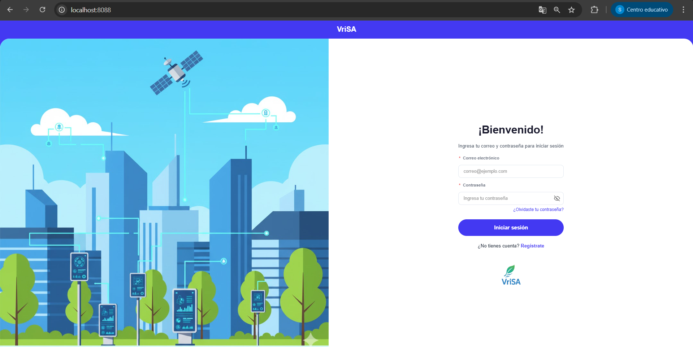

# Backend VriSA - Sistema de Monitoreo Ambiental

Backend robusto desarrollado en **Django (GeoDjango)** para la gestión, recolección y análisis de datos de calidad del aire. Este sistema implementa el estándar **US EPA** para el cálculo del Índice de Calidad del Aire (AQI) y gestiona una red de estaciones de monitoreo IoT.

## Características y Módulos del Sistema

El proyecto está estructurado en módulos (Apps) desacoplados para garantizar escalabilidad y mantenimiento:

### 1. Gestión de Usuarios (`src.users`)
Sistema avanzado de autenticación y autorización mediante **JWT (JSON Web Tokens)**.
- **Roles y Permisos:** Soporte para múltiples roles (Super Admin, Representante Institucional, Admin de Estación, Investigador, Ciudadano).
- **Validación:** Flujos de aprobación para roles sensibles y registro de investigadores.

### 2. Instituciones Ambientales (`src.institutions`)
Gestión de entidades propietarias de las estaciones (ej. DAGMA, CVC).
- **Personalización:** Manejo de identidad visual (Logos y colores corporativos).
- **Jerarquía:** Vinculación de usuarios y estaciones a instituciones específicas.

### 3. Estaciones de Monitoreo (`src.stations`)
Núcleo geoespacial del proyecto utilizando **PostGIS**.
- **Geolocalización:** Ubicación precisa (Latitud/Longitud) y consultas espaciales (búsqueda por radio).
- **Seguridad IoT:** Generación automática de tokens de autenticación para el hardware.

### 4. Sensores y Mantenimiento (`src.sensors`)
Inventario de hardware instalado.
- **Ciclo de Vida:** Control de estados (Activo, Inactivo, Mantenimiento).
- **Bitácora:** Registro de mantenimientos, calibraciones y certificados.

### 5. Mediciones y Reportes (`src.measurements`)
Motor de procesamiento de datos en tiempo real.
- **Cálculo AQI:** El servicio de AQI calcula el Índice de Calidad del Aire basado en el estándar **US EPA** utilizando 6 contaminantes atmosféricos: (PM2.5, PM10, O3, CO, NO2, SO2).
- **Reportes PDF:** Generación automática de informes con estadísticas y gráficas (Pandas/Matplotlib).
- **Simulador:** Generación de datos sintéticos realistas.

---

## Stack Tecnológico

- **Lenguaje:** Python 3.11
- **Framework:** Django 5.2 + Django REST Framework
- **Base de Datos:** PostgreSQL 15 + PostGIS (Geospatial)
- **Ciencia de Datos:** Pandas, Matplotlib, ReportLab
- **Infraestructura:** Docker, Docker Compose

---

## Instalación y Despliegue con Docker

### 1. Requisitos Previos
- Tener instalado **Docker** y **Docker Compose**.

---

### 2. Clonamos el repositorio:

```
git clone <url_del_repositorio>
```
---
### 2. Levantar el Proyecto

Para construir las imágenes e iniciar los contenedores por primera vez (puede llegar a demorar por la cantidad de librerias):

```bash
docker compose up --build -d
```

Para iniciar el proyecto en ocasiones posteriores:

``` bash
docker compose up -d
```
---
### 3. Acceder a la aplicación

La aplicación estará disponible en: http://localhost:8088/



---

## Usuarios creados por defecto
A nivel del archivo [seed_db](src/users/management/commands/seed_db.py) se tiene un script para poblar la base de datos en entorno de desarrollo.
Por ello, es recomendable tener en cuenta que existirán usuarios listos para utilizarse en el frontend:

---

**Superusuario**

    correo: admin@vrisa.com
    password: admin1234

**Representante de institución** 

    correo:john.doe@dagma.gov
    password: doe1234

**Administrador de estación** 

    correo: pepito.perez@gmail.com
    password: pepito1234

Comando para hacerlo de forma manual:

```bash
docker compose exec backend python manage.py seed_db
```

Genera mediciones simuladas de los últimos 30 días con patrones realistas y anomalías aleatorias. Ideal para probar las gráficas del frontend:

```bash
docker compose exec backend python manage.py seed_history
```

Este comando es personalizado y se ejecuta automáticamente en el contenedor simulator.
Sin embargo, si quisieras correrlo manualmente en la consola para ver qué hace en tiempo real, podrías detener el simulador y correrlo tú mismo:

```bash
# 1. Detener el contenedor automático
docker compose stop simulator
```
```bash
# 2. Correrlo manualmente para ver los logs en tu terminal
docker compose exec backend python manage.py start_simulation
```

---


## Comandos útiles

Para detener el servicio:

```bash
docker compose down
```
Para destruir el contenedor:

```bash
docker compose down -v
```

###  Ejecucion de Migraciones 
```bash
docker-compose exec backend python manage.py makemigrations
```
```bash
docker-compose exec backend python manage.py migrate
```
---

### Comandos de Django para crear una nueva app 

```bash
docker compose exec backend python manage.py startapp nombre_nueva_app
```

---
### Ejecutar Tests
Para asegurarte de que todo el código funciona correctamente:

```Bash
docker compose exec backend python manage.py test
```

